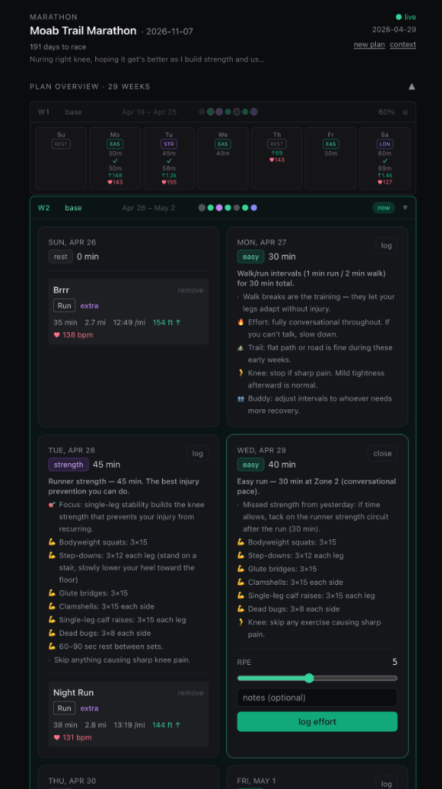

# Abacus

**An orchestration platform for headless, agentic products built on Claude Code.**

Abacus is a locally hosted, remotely accessible platform. It handles API routing,
webhook listening, task queuing, and cross-session memory. It spawns isolated Claude
Code sessions in detached `tmux` to do the actual reasoning, with strict budget and
iteration guardrails. The platform itself contains zero domain logic — that lives in
each product.

## Products

Abacus hosts many products. Each is a folder under `packages/<name>/`.

| Product               | Package              | Status               |
| --------------------- | -------------------- | -------------------- |
| Marathon Planner      | `packages/marathon/` | live PoC             |
| Family weekly planner | _planned_            | future               |
| Meal planner          | _planned_            | future               |
| Trip planner          | _planned_            | future               |

Adding a product is by convention: create a `packages/<name>/` directory with
`claude.md`, `.claude.json`, `abacus.json` (platform-scoped manifest with the
hot-memory policy), and `.platform-denylist`. The platform discovers it
automatically — no code changes to `packages/abacus/`.

## What the platform does today

- **HTTP + SSE surface** (Fastify on `:3001`) for invoking tasks, posting webhooks, listing tasks, tailing per-task logs, and reading product-owned state.
- **Task queue** backed by Beads (`platform:agent-task` issues), with dedupe by key within a TTL.
- **Dispatcher** that claims a pending task, spawns a detached `tmux` session, and arms a wall-clock watchdog.
- **Two runner backends**: `dummy` (no-op script for tests) and `claude` (production — spawns `claude -p --output-format json --mcp-config <merged> --append-system-prompt <product/claude.md>` with the rendered prompt on stdin).
- **Product discovery by convention**: `mcp-host` scans `packages/*/` for any directory containing `claude.md` + `.claude.json` + `abacus.json`. There is no platform-side registry.
- **Per-product hot memory**: each product declares which Beads types are "hot" in its `abacus.json`; the platform loads them at task-start and renders them into the prompt. Cold memory is exposed to the agent as a SELECT-only `query_history` MCP tool against Dolt.
- **Webhook shim mechanism**: products declare `webhooks[source].preScript` in `abacus.json`; the platform spawns the shim with the request, parses a JSON action, and acts accordingly. Used for the Strava `hub.challenge` handshake + activity POSTs.
- **State shim mechanism**: products declare `state.preScript` in `abacus.json`; `GET /api/:product/state` spawns it, captures JSON stdout, and returns it verbatim. Dashboards use this to read product-owned state.
- **Product-scoped dashboards** at `packages/<product>/dashboard/` (Next.js App Router + React 19 + Tailwind 3). Reads via `/api/:product/state`, writes via `/api/:product/invoke`, refetches on `TASK_COMPLETE`/`TASK_FAILED` from `/api/:product/events` (SSE).
- **OpenTelemetry tracing**: every task produces a single trace tree `task.received → task.settled → {runner.prepare, memory.loaded, tmux.spawned}`. Trace context propagates across the queue boundary via a `traceparent` field stamped onto the task's Beads metadata. A zero-infra JSONL exporter writes to `runtime/otel/spans-<startedAt>.jsonl`; setting `OTEL_EXPORTER_OTLP_ENDPOINT` adds OTLP HTTP export for Jaeger/Tempo.
- **CI lints** that enforce the platform/product boundary: `lint:zfc` forbids payload-content branching in `packages/abacus/src/`; `lint:purity` greps every product's `.platform-denylist` against platform code.

## Marathon product (live)

Marathon (`packages/marathon/`) is the first product and the platform's PoC.




- `scripts/seed-plan.ts` — deterministic CLI that lays down 1 plan + N week-blocks + 7N workouts in Beads.
- `scripts/strava-onboard.ts` — one-shot OAuth handshake; writes `STRAVA_REFRESH_TOKEN` to `.env.local`.
- `scripts/strava-subscribe.ts` — create / list / delete Strava webhook push-subscriptions.
- `scripts/strava-webhook-shim.ts` — handles the `hub.challenge` GET handshake and transforms POSTs into `enqueue(process_activity)` actions with a dedupe key.
- `scripts/fetch-and-store-strava.ts` — mechanical: refresh OAuth, fetch activity, write a `marathon:strava-activity` issue. Has `STRAVA_OFFLINE=1` mode for tests. Skips Strava fetch for reassign/reconcile payloads.
- `scripts/ingest-perceived-effort.ts` — webhook handler for the slider; writes a `marathon:effort-log` issue.
- `scripts/manual-activity-shim.ts` — handles add/delete/reassign/insert-and-match operations for activities. Insert-and-match creates new workouts for gap days and triggers agent rebalancing.
- `scripts/get-state.ts` — state shim returning the active plan, 14-day window of workouts, recent efforts/activities/flags.
- `mcp-servers/training-plan/` — exposes `get_plan`, `update_workout`, `query_history`, `flag_overtraining` to the agent.
- `dashboard/` — Next.js UI: full 28-week plan overview with expandable workout tiles, bulk activity matching (reassign + insert-and-match), perceived-effort slider, live task stream.

## Repo layout

```
packages/
  abacus/                  # The platform (product-agnostic)
  marathon/                # Product #1
    dashboard/             # Product-scoped Next.js UI
docs/
  spec.md                  # Living product + technical spec
  architecture.md          # Module map and boundaries
  runbook.md               # Operate / debug
  adr/                     # Append-only architectural decisions
scripts/
  doctor.sh                # Preflight — verifies bd, dolt, tmux, claude, node, pnpm
  dev-up.sh                # One-command stack: platform + dashboard + tunnel + Strava sub
  lint-zfc.ts              # Forbids payload-content branching in platform code
  lint-platform-purity.ts  # Greps every product's .platform-denylist against platform code
```

## Quick start

```bash
# Preflight — checks every required binary is present
bash scripts/doctor.sh

# Install workspace dependencies
pnpm install

# Copy local env template and fill in secrets
cp .env.example .env.local
```

**Required tools** (verified by `doctor.sh`): Node ≥ 22, pnpm (via corepack), `bd`
(Beads CLI), `dolt`, `tmux`, `claude` (Claude Code CLI). On macOS these install via
Homebrew (`bd`, `dolt`, `tmux`), mise/nvm/fnm (Node), corepack (pnpm), and the
official Claude Code installer.

### Bring the whole stack up

```bash
bash scripts/dev-up.sh
```

Starts the platform on `:3001`, the marathon dashboard on `:3000`, a `cloudflared`
quick tunnel, and registers a Strava webhook subscription pointing at the tunnel.
Cleans up the subscription + child processes on `Ctrl-C`. Flags: `--no-tunnel`,
`--no-dashboard`. Per-process logs land in `runtime/dev-logs/`.

### Production mode (faster)

```bash
bash scripts/prod-up.sh
```

Builds the platform (tsc) and dashboard (next build) first, then runs the
compiled artifacts instead of tsx-watch + Next.js dev mode. Noticeably faster
page loads and interaction. Use `--skip-build` to reuse existing build artifacts.
Same flags as `dev-up.sh` (`--no-tunnel`, `--no-dashboard`). Logs in
`runtime/prod-logs/`.

### Or start pieces individually

```bash
# Platform only (dummy runner — for development without Claude API costs)
pnpm --filter @abacus/platform dev

# Platform with the production runner (spawns real claude sessions)
ABACUS_RUNNER=claude pnpm --filter @abacus/platform dev

# Marathon dashboard (in a second terminal)
pnpm --filter @abacus-products/marathon-dashboard dev
```

### Smoke tests

```bash
pnpm --filter @abacus/platform smoke          # server + dispatcher + tmux end-to-end (DummyRunner)
pnpm --filter @abacus/platform smoke:m2       # product discovery + memory + cold-query SELECT-only guard
pnpm --filter @abacus/platform smoke:m3       # ClaudeRunner.prepare wiring (no real claude spawn)
pnpm --filter @abacus/platform smoke:webhook  # webhook shim: handshake + enqueue + rejection paths
pnpm --filter @abacus/platform smoke:m5       # drop-in product synthesized in tmpdir + OTel trace tree
```

The drop-in product smoke is the platform/product separation regression test: it
synthesizes a throwaway product in a tmpdir, boots the platform against it (no
edits to `packages/abacus/`), runs a task end-to-end, and asserts the OTel trace
tree is intact.

### Lints

```bash
pnpm -w run lint           # ZFC + platform-purity
pnpm -w run lint:zfc       # Forbids payload-content branching in packages/abacus/src/
pnpm -w run lint:purity    # Greps every product's .platform-denylist against platform code
```

## Core principles

Abacus is built on five load-bearing tenets (see `CLAUDE.md` for the full text):

1. **Product lens** — probe the goal before executing.
2. **Documentation is a first-class deliverable** — README and `docs/` updated with every change.
3. **Zero Framework Cognition (ZFC)** — platform code does no reasoning; all judgement lives in Claude sessions and product `claude.md` files.
4. **DRY** — reuse before you add.
5. **Platform and products stay separate** — platform never names a product domain; products never reach into platform internals; products never reference other products.

## Spec & architecture

- `docs/spec.md` — living product + technical specification
- `docs/architecture.md` — module map
- `docs/runbook.md` — operate and debug the running system
- `docs/adr/` — architectural decisions
- `CLAUDE.md` — engineering tenets

## License

TBD.
