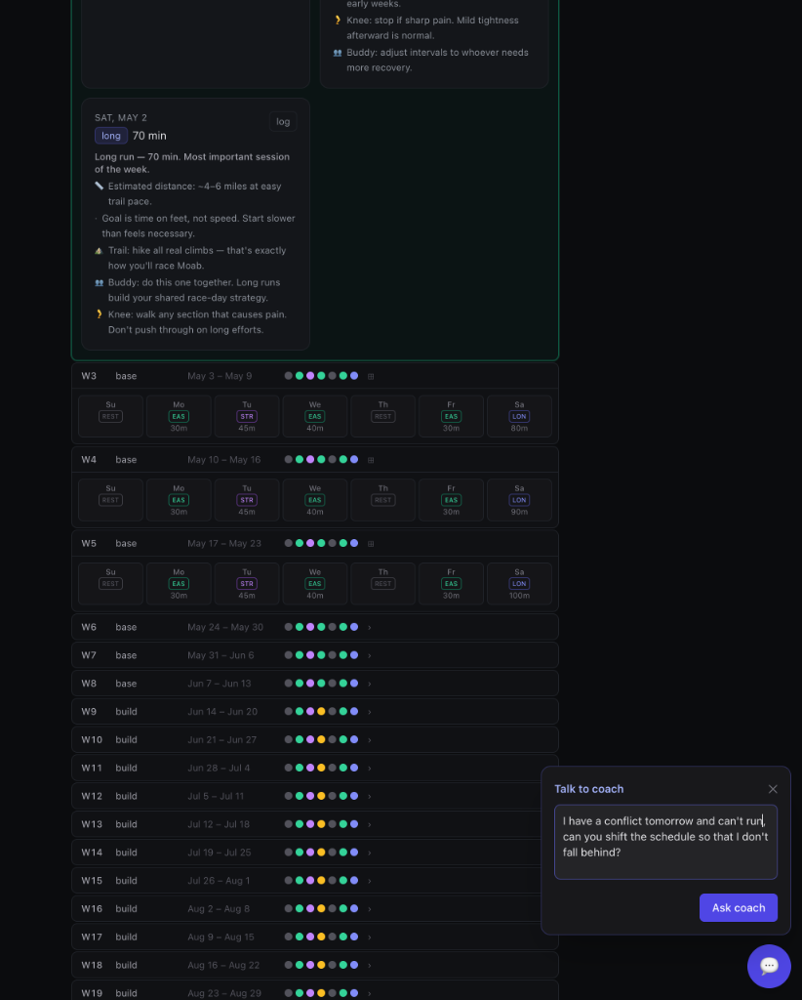

# Marathon Planner

The Marathon Planner is the first product built on the Abacus platform. It ingests Strava
activities, maintains a structured training plan, and uses Claude Code sessions to reconcile
what was actually done against what was planned — adapting upcoming workouts when life gets
in the way.

## Preview


_The main dashboard showing the full 28-week plan, expandable workout tiles, and the current week's progress._


_The "Ask Coach" floating action button allows for natural language interaction with the training plan._


## What it does

- **Race-driven planning** — input a target race (name, date, distance) plus a training
  start date and free-form steering context (injuries, training partner, schedule constraints).
  A Claude session reads the context, picks the closest-fit plan template, and generates a
  full week-by-week plan via MCP tools.
- **Historical Strava backfill** — on plan creation, all Strava activities since `startDate`
  are pulled and stored as `marathon:strava-activity` issues, so the plan starts seeded with
  real history.
- **Activity reconciliation** — when a Strava activity arrives, a Claude session finds the
  matching planned workout for that day, records what was *actually* done (met / partial /
  swapped / skipped / extra), and adjusts upcoming workouts for the rest of the current week
  and the next week.
- **Manual activity controls** — add an activity that didn't sync, or remove one that was
  misattributed. Both flow through the same reconciliation agent.
- **Steering context editor** — edit the free-form notes the agent reads whenever it makes
  a plan adjustment. Changes trigger a `daily_reeval` task.
- **Daily re-evaluation** — a scheduled (launchd) task re-reads the plan-context and recent
  history and adjusts upcoming workouts if constraints have changed.
- **Perceived effort logging** — log RPE (1–10) and notes for completed workouts directly
  from the dashboard to help the coach gauge your fatigue and recovery.


## Dashboard routes

| Route | Purpose |
| ----- | ------- |
| `/` | Plan overview (all 28 weeks as compact rows with workout dots, expandable), unmatched activity matching, activity log, flags |
| `/plan/new` | Race + start date + steering context form → kicks off plan creation |
| `/plan/context` | Edit the free-form steering notes for the active plan |

### Plan overview

The main dashboard now shows every week of the plan in a compact row with
color-coded dots per workout kind (emerald=easy, indigo=long, amber=tempo, etc.).
The current week auto-scrolls into view and is highlighted with a green "now"
badge. Past weeks are dimmed with a completion percentage. Click any row to
expand it into full workout tiles showing planned targets and actual activity
details (name, distance, time, pace) when matched.

A global "Ask Coach" floating action button (bottom right) opens a chat interface
where you can ask questions about your plan, request schedule adjustments, or
get training advice.

**Coach conversations are persistent** — your full message history with the coach is stored and visible when you reopen the chat. When you send a message, the coach agent reads your recent training data and any plan adjustments needed, replies in plain language describing exactly what it changed (or why no changes were needed), and any workout modifications appear in the plan immediately.


## Plan templates

Agent-readable markdown in `templates/plans/`. The generation agent picks the closest fit
based on plan-context notes and backfilled Strava history:

| Template | When to use |
| -------- | ----------- |
| `couch-to-marathon` | No consistent running base in the last 90 days |
| `base-builder` | Already running 15–25 km/week |
| `competitive` | Regularly racing, target finish time in mind |

Templates are never consumed by orchestrator code — only by the Claude session during
`generate_plan`. To add a new template, drop a `.md` file in `templates/plans/` and
follow the structure of the existing ones.

## Creating a plan

1. Open `/plan/new` in the dashboard.
2. Fill in race name, date, distance, training start date, and steering context.
3. Optionally pin a template; otherwise the agent chooses.
4. Submit — the shim creates `marathon:race`, `marathon:training-plan`, and
   `marathon:plan-context` entities, then enqueues `backfill_strava` → `generate_plan`
   in sequence.
5. Watch task activity in the dashboard header; the plan populates within ~60–90 seconds.

## Strava reconciliation

Every incoming Strava activity (via the webhook) runs the `process_activity` task:

1. The Claude session finds the workout whose `date` matches the activity's local date.
2. It calls `set_workout_actual` with `deviationStatus` per the rules in `claude.md`:
   - `met` — activity matches kind and is within ±25% of target duration
   - `partial` — ran, but shorter than planned
   - `swapped` — completely different activity kind
   - `skipped` — no matching activity (date has passed)
   - `extra` — activity on a rest day or with no matching workout
3. For `swapped` or `skipped`, the session adjusts rest-of-week and next-week workouts.

Deviation status badges appear on workout tiles in the dashboard.

## Manual activity controls

From the Activity log on the dashboard:

- **Remove** — click "Remove" on any activity row. The linked workout's `actual` is cleared
  and a reconciliation pass runs automatically.
- **Add** — fill in the "Add manual activity" form at the bottom of the activity log. The
  activity is stored as a `marathon:strava-activity` with `source: 'manual'` and a
  reconciliation pass runs.
- **Match by date** — from the "Unmatched activities" section, click "Match by date" to
  propose bulk matches. Activities are joined to workouts by date. For activities on
  days with no existing workout, a new workout is inserted into the plan (see below).

### Bulk match types

- **Reassign** — activity date matches an existing unmatched workout. The workout's
  `actual` is set immediately and a `daily_reeval` task is enqueued.
- **Insert-and-match** — activity date falls within a plan week but has no workout.
  A new workout is created in the week-block (kind inferred from sport type via
  `mapStravaTypeToActualKind`), the activity is set as its `actual`, and a
  `daily_reeval` task is enqueued so the agent can rebalance subsequent workouts.

Via the API directly:

```bash
# Add
curl -X POST http://127.0.0.1:3001/api/marathon/webhook/manual_activity \
  -H 'content-type: application/json' \
  -d '{"op":"add","activity":{"date":"2026-04-25","type":"Run","durationMin":45}}'

# Delete
curl -X POST http://127.0.0.1:3001/api/marathon/webhook/manual_activity \
  -H 'content-type: application/json' \
  -d '{"op":"delete","activityIssueId":"<beads-id>"}'

# Reassign an activity to a different workout
curl -X POST http://127.0.0.1:3001/api/marathon/webhook/manual_activity \
  -H 'content-type: application/json' \
  -d '{"op":"reassign","activityIssueId":"<beads-id>","workoutId":"<beads-id>"}'

# Insert a new workout and match an activity to it
curl -X POST http://127.0.0.1:3001/api/marathon/webhook/manual_activity \
  -H 'content-type: application/json' \
  -d '{"op":"insert-and-match","activityIssueId":"<beads-id>","weekBlockId":"<beads-id>","date":"2026-04-25"}'
```

## Plan-context editing

Open `/plan/context` in the dashboard. Changes are saved via the `update_plan_context`
webhook and trigger a `daily_reeval` task so the agent can immediately adjust upcoming
workouts to reflect the new constraints.

## Daily re-eval cron

See `docs/runbook.md` → "Marathon — daily re-evaluation cron (launchd)" for the launchd
plist and manual trigger instructions.

## Data model

```
marathon:race            — target event (name, date, distance, optional goalFinishTime)
marathon:training-plan   — plan shell (raceId, raceDate, startDate, weeks, templateId?)
marathon:plan-context    — steering notes (planId, notes, updatedAt)
marathon:week-block      — one week (planId, weekIndex, theme, startDate)
marathon:workout         — one session (weekBlockId, date, kind, targetDurationMin, actual?)
marathon:strava-activity — raw Strava activity or manual addition
marathon:effort-log      — perceived-effort entry (RPE 1–10)
marathon:flag            — overtraining or concern flag
```

`WorkoutKind`: `easy | long | tempo | intervals | rest | cross | strength`

`workout.actual.deviationStatus`: `met | partial | swapped | skipped | extra`

## Components

The Marathon product consists of several key components:

- **Scripts** (`scripts/`):
    - `seed-plan.ts` — deterministic CLI that lays down 1 plan + N week-blocks + 7N workouts in Beads.
    - `strava-onboard.ts` — one-shot OAuth handshake; writes `STRAVA_REFRESH_TOKEN` to `.env.local`.
    - `strava-subscribe.ts` — create / list / delete Strava webhook push-subscriptions.
    - `strava-webhook-shim.ts` — handles the `hub.challenge` GET handshake and transforms POSTs into `enqueue(process_activity)` actions with a dedupe key.
    - `fetch-and-store-strava.ts` — mechanical: refresh OAuth, fetch activity, write a `marathon:strava-activity` issue. Has `STRAVA_OFFLINE=1` mode for tests. Skips Strava fetch for reassign/reconcile payloads.
    - `ingest-perceived-effort.ts` — webhook handler for the slider; writes a `marathon:effort-log` issue.
    - `manual-activity-shim.ts` — handles add/delete/reassign/insert-and-match operations for activities. Insert-and-match creates new workouts for gap days and triggers agent rebalancing.
    - `get-state.ts` — state shim returning the active plan, 14-day window of workouts, recent efforts/activities/flags.
- **MCP Server** (`mcp-servers/training-plan/`): exposes `get_plan`, `update_workout`, `query_history`, and `flag_overtraining` to the agent.
- **Dashboard** (`dashboard/`): Next.js UI featuring the full 28-week plan overview, expandable workout tiles, bulk activity matching, perceived-effort slider, and a live task stream.


## Development

```bash
# Dev mode (tsx watch + Next.js dev — hot reload, slower)
bash scripts/dev-up.sh

# Production mode (builds first, then runs compiled — much faster)
bash scripts/prod-up.sh

# Common flags for both scripts:
#   --no-tunnel        skip cloudflared + Strava subscription
#   --no-dashboard     skip starting the marathon dashboard

# prod-up.sh only flags:
#   --skip-build       skip the build step (use existing artifacts)
#   --public-dashboard expose the dashboard via a public HTTPS URL (tunnel)
```

Or run pieces individually:

```bash
pnpm --filter @abacus-products/marathon test       # run vitest
pnpm --filter @abacus-products/marathon typecheck  # tsc --noEmit
```

See `docs/runbook.md` for the full operations guide.
